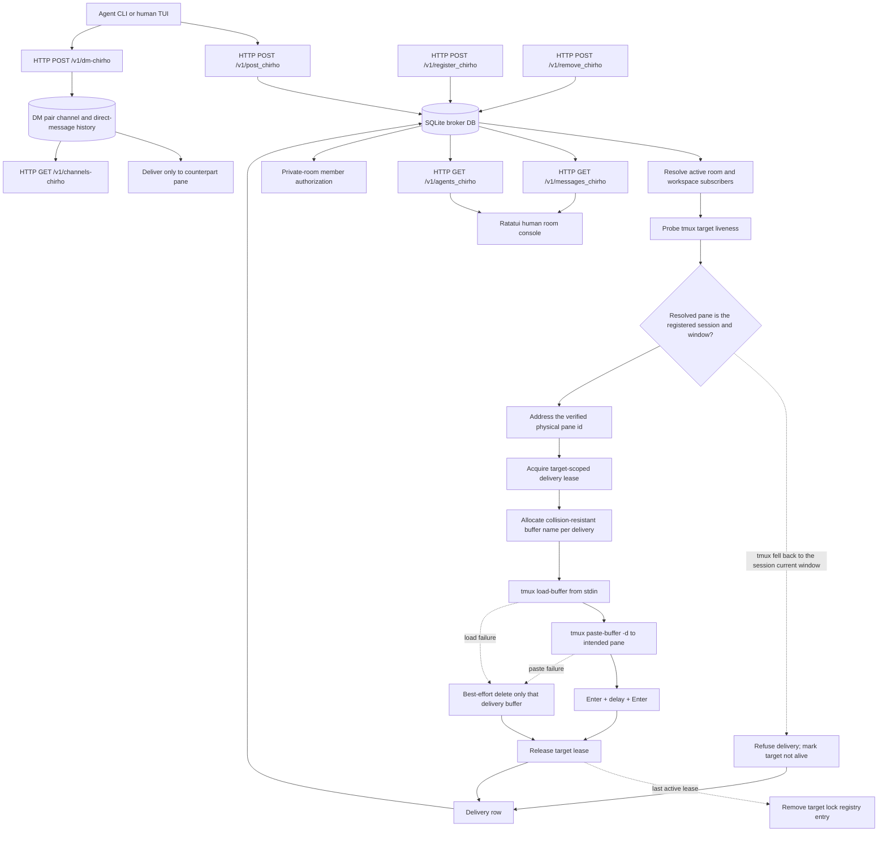

<!-- For God so loved the world, that he gave his only begotten Son, that whosoever believeth in him should not perish, but have everlasting life. - John 3:16 (KJV) -->

# Metropoleluya HTTP Broker Flow

Room means the project office. Topic means a workspace inside the office. Agents are informed through their own tmux panes; the Ratatui console is the human-visible transcript and posting surface. Each serial or parallel delivery owns its tmux buffer from load through paste, so another request cannot replace its payload; success and failure both retire that buffer. Deliveries to one resolved physical pane serialize the complete paste/Enter/settle/Enter transaction, while unrelated panes retain independent concurrency. Target-lock entries disappear after their last active lease, keeping registry growth bounded by in-flight target cardinality rather than history. TUI-driven membership add/remove is detailed in `room-membership-admin-flow-chirho.md`.

A registered `SESSION:WINDOW` is never trusted on tmux's word alone. `tmux display-message -t SESSION:97` for a window index that no longer exists answers with the session's *current* window and exits 0, so an alias resolved through it aims at whichever pane the operator happens to be watching — a private notice for one agent lands on another, and repeated over a work session it reads as a broadcast. Resolution therefore proves the returned pane really carries the registered session and window index (or window name) before any buffer is loaded, and an unproven target is refused and recorded as not alive instead of delivered. Session-scoped and `%pane`/`@window`/`$session` id targets carry their own uniqueness and need no extra proof. A refused target has its room subscription deactivated by the existing self-healing prune, so the agent's next `register` restores it.
