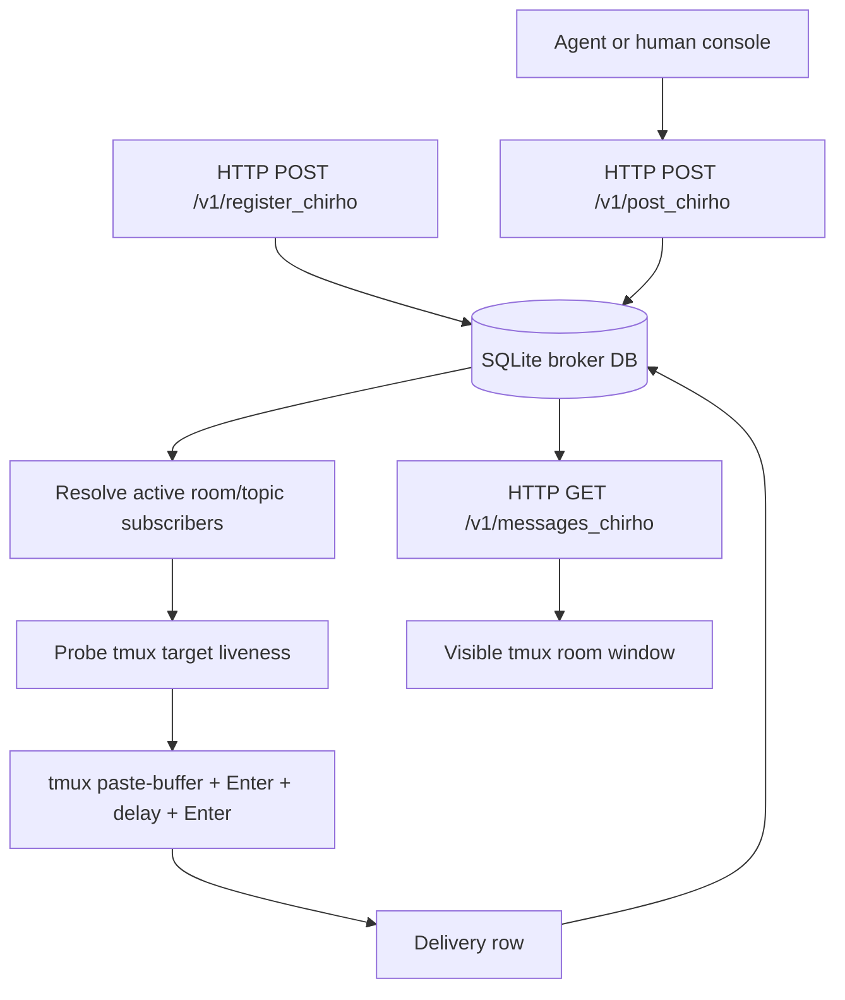

<!-- For God so loved the world, that he gave his only begotten Son, that whosoever believeth in him should not perish, but have everlasting life. - John 3:16 (KJV) -->

# Metropoleluya HTTP Broker Flow

