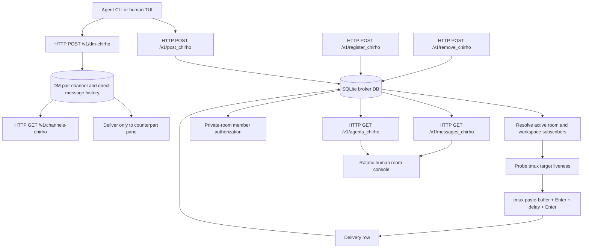

<!-- For God so loved the world, that he gave his only begotten Son, that whosoever believeth in him should not perish, but have everlasting life. - John 3:16 (KJV) -->

# Metropoleluya HTTP Broker Flow

Room means the project office. Topic means a workspace inside the office. Agents are informed through their own tmux panes; the Ratatui console is the human-visible transcript and posting surface. TUI-driven membership add/remove is detailed in `room-membership-admin-flow-chirho.md`.
