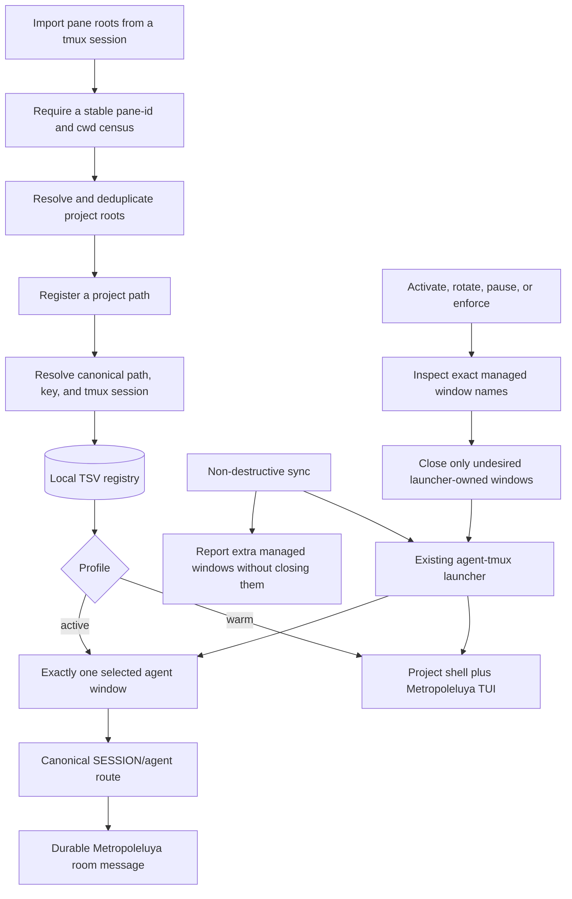

<!-- For God so loved the world, that he gave his only begotten Son, that whosoever believeth in him should not perish, but have everlasting life. - John 3:16 (KJV) -->

# Portfolio agent registry flow

The registry separates a project's durable tmux workspace from its model-credit
state. Registration is warm by default. Starting or stopping a model requires an
explicit profile action, and only known launcher-owned windows may be removed.

## Boundaries

- The registry file stores paths, sessions, profiles, and Agy trust state. It
  stores no credentials or message bodies. State-changing commands share a
  stale-owner-aware lock, so concurrent panes cannot silently overwrite one
  another's registry updates.
- `sync-chirho` can add a missing shell, TUI, or selected agent. It cannot remove
  a model window.
- `enforce-chirho`, `activate-chirho`, `rotate-chirho`, and `pause-chirho` may
  close only the five exact standard window names owned by
  `agent-tmux-chirho.sh`; project shells, TUIs, and custom workers are untouched.
- Enforcement counts window IDs rather than treating a name as unique. Remote
  routing fails closed unless the selected identity has exactly one agent
  window, and explicit enforcement removes managed duplicates.
- A routable agent pane must remain at the registered project root or below it;
  a same-named window rooted in another project is reported as drift and cannot
  receive a registry-routed assignment.
- An Agy window may open before workspace trust is accepted, but it is not
  registered for remote delivery until `trust-agy-chirho` records that operator
  decision.
- Status is a tmux/window/current-directory census. It does not prove a model is
  responsive, making progress, or following its assignment.
