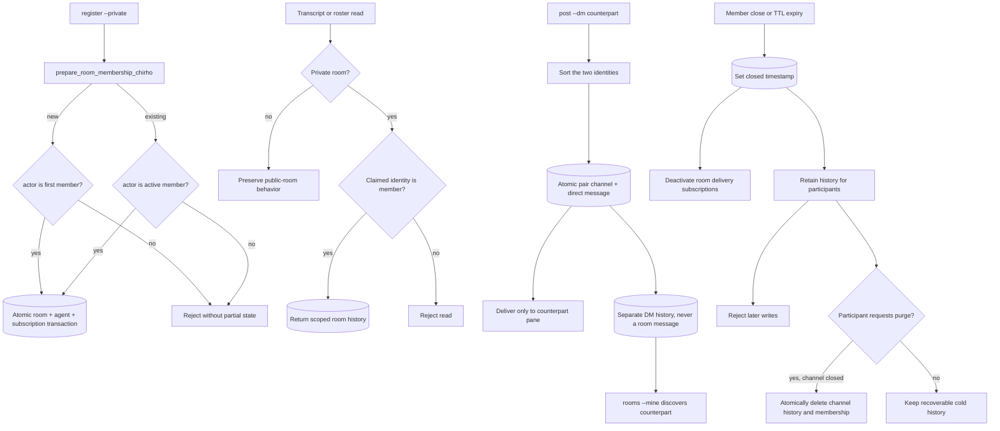

<!-- For God so loved the world, that he gave his only begotten Son, that whosoever believeth in him should not perish, but have everlasting life. — John 3:16 (KJV) -->

# Private Channels Flow Chirho

Public rooms are deliberately backward compatible. Private rooms and DMs use
broker-level identity membership on a localhost, single-user service. This
prevents accidental cross-room reads through the API, but it is not a
cryptographic boundary against another process running as the same OS user:
that process can claim an identity or open the SQLite database directly.

Lifecycle is cold retirement, not deletion. Explicit close and TTL expiry stop
new writes and delivery, preserve participant history, and allow discovery with
`--include-closed`. An explicit participant-authorized purge is the destructive
bounded-growth escape hatch; open channels and automatic expiry cannot purge.

Implementation anchors:

- `src/channels_chirho.rs`: schema migration, room authorization, DMs,
  discovery, closure, and TTL retirement.
- `src/main.rs`: atomic registration, authorized room posting, HTTP routing,
  and CLI dispatch.
- `src/tui_chirho.rs`: supplies the configured identity on room transcript and
  roster reads.
