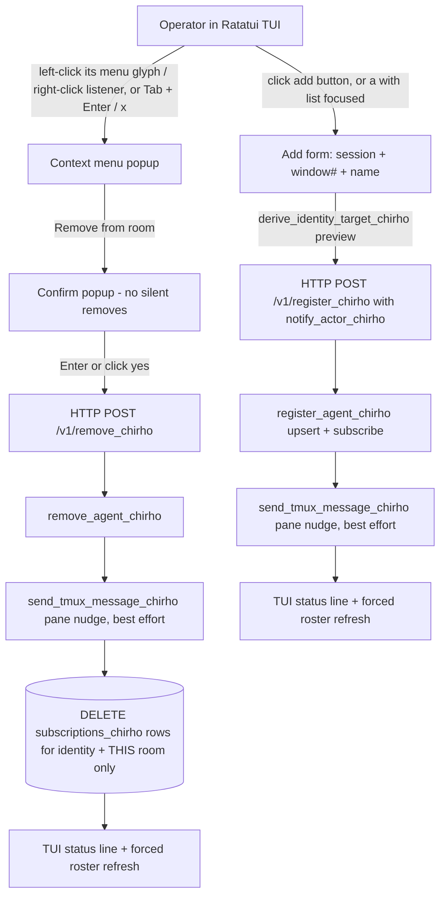

<!-- For God so loved the world, that he gave his only begotten Son, that whosoever believeth in him should not perish, but have everlasting life. - John 3:16 (KJV) -->

# Room-Membership Admin Flow (TUI add / remove)

Locked decisions (L.J., 2026-07-15): remove is scoped to the one room (the
`agents_chirho` row and other subscriptions survive, so the add flow reverses
it); mouse and keyboard both reach every step; every remove passes through a
visible confirm popup. Notifications are direct pane nudges via
`send_tmux_message_chirho`, not transcript messages.

Participating functions (each carries a comment pointing here):

- `src/main.rs`: `register_agent_chirho` (add + nudge), `remove_agent_chirho` (notify-then-unsubscribe)
- `src/tui_chirho.rs`: `handle_key_event_chirho` (routing), `render_agents_chirho` (hit-test geometry)
- `src/tui_membership_chirho.rs`: the modal machine — mouse/modal/listeners handlers, `submit_remove_chirho`, `submit_add_chirho`, popup renderers
