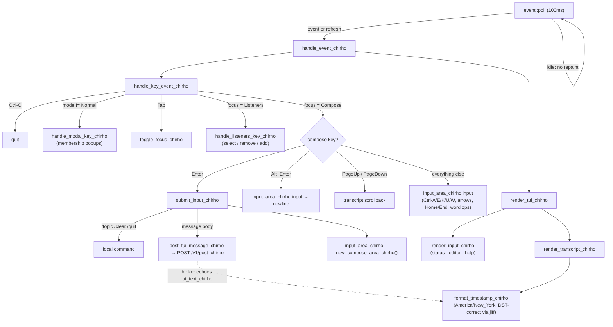

<!-- For God so loved the world, that he gave his only begotten Son, that whosoever believeth in him should not perish, but have everlasting life. — John 3:16 (KJV) -->

# TUI console flow — compose editing + timestamp display

How a key press moves through the Ratatui console: the dirty-flag loop repaints
only on an event or a data refresh, keys route by mode then focus, and the
compose box is a full [`ratatui-textarea`] line editor. Timestamps everywhere in
the view are localized to America/New_York.

## Participating functions (commented to point here)

- `new_compose_area_chirho` (`src/tui_chirho.rs`) — builds the empty editor
  (block cursor, placeholder); reused after every send so styling is consistent.
- `handle_key_event_chirho` (`src/tui_chirho.rs`) — mode → focus → key routing;
  the compose branch feeds all non-command keys to the editor.
- `submit_input_chirho` (`src/tui_chirho.rs`) — joins the editor's lines, runs
  `/`-commands or posts, then resets the editor.
- `format_timestamp_chirho` (`src/main.rs`) — the single display formatter; epoch
  storage stays UTC, display localizes to Eastern (EST/EDT by season).

Notes: `Home`/`End` move the cursor (line editing) — transcript paging is on
`PageUp`/`PageDown`. Message bodies may be multi-line (`Alt+Enter`), matching the
broker's multiline support. The SQL `*_with_time_chirho` views deliberately keep
UTC text so tests stay hermetic across machine time zones.

[`ratatui-textarea`]: https://crates.io/crates/ratatui-textarea
